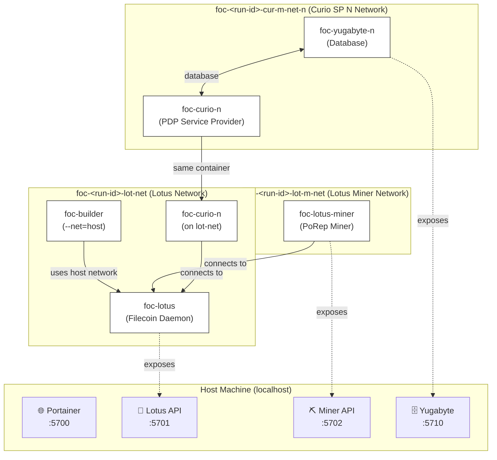

# Advanced Guide: foc-devnet

This guide covers advanced usage, internal architecture, and operational details of foc-devnet.

---

## Commands Reference

### `init`
Initializes foc-devnet by downloading repositories, building Docker images, and preparing the environment.

```bash
foc-devnet init [OPTIONS]
```

**Options:**
- `--curio <SOURCE>` - Curio source location
- `--lotus <SOURCE>` - Lotus source location
- `--filecoin-services <SOURCE>` - Filecoin Services source location
- `--synapse-sdk <SOURCE>` - Synapse SDK source location
- `--yugabyte-url <URL>` - Yugabyte download URL
- `--yugabyte-archive <PATH>` - Local Yugabyte archive file
- `--proof-params-dir <PATH>` - Local proof params directory
- `--force` - Force regeneration of config file. Useful when switching between configurations.
- `--rand` - Use random mnemonic instead of deterministic one. Use this for unique test scenarios.

**Source Format:**
- `gittag:v1.0.0` - Specific git tag (uses default repo)
- `gittag:https://github.com/user/repo.git:v1.0.0` - Tag from custom repo
- `gitcommit:abc123` - Specific git commit
- `gitbranch:main` - Specific git branch
- `local:/path/to/repo` - Local directory

**Example:**
```bash
foc-devnet init \
    --lotus local:/home/user/lotus \
    --curio gitbranch:pdpv0 \
    --force
```

### `build`
Builds Lotus and Curio binaries in Docker containers.

> **Note:** This command must be run after `init` to ensure Docker images and environment are prepared.

```bash
foc-devnet build lotus [PATH]
foc-devnet build curio [PATH]
```

**Note:** Binaries are built to `~/.foc-devnet/bin/` which is the expected location for the system.

**Example:**
```bash
foc-devnet build lotus
foc-devnet build curio /path/to/custom/curio
```

### `start`
Starts the local Filecoin network cluster.

> **Note:** This command should be run after `build` of `lotus` and `curio` to ensure binaries are available.

```bash
foc-devnet start [OPTIONS]
```

**Options:**
- `--parallel` - **⚡ Run steps in parallel for ~40% faster startup (recommended)**

**Why `--parallel` (Recommended):**
- **⚡ Significant speedup:** Reduces startup time from ~5 min to ~3 min
- **Smart parallelization:** Steps that don't depend on each other run concurrently
- **Production-ready:** Thread-safe implementation with proper synchronization
- **Use case:** Default for most workflows, especially development iteration

**When NOT to use `--parallel`:**
- Debugging step ordering issues
- Very low-resource machines (< 4GB RAM)
- First-time setup (sequential is easier to follow)

See [Detailed Start Sequence](#detailed-start-sequence) for information about which steps are parallelized.

- `--notest` - Skip end-to-end tests. Use when rapid iteration is needed.

**Recommended for faster startup:**
```bash
foc-devnet start --parallel
```

**Skip tests during development:**
```bash
foc-devnet start --parallel --notest
```

**After successful start:**
- Portainer UI available at http://localhost:5700 (uses first port in configured range)
- Use Portainer to monitor containers, view logs, and debug issues
- All container names include the run ID for easy identification

### `stop`
Stops all running containers and cleans up Docker networks.

```bash
foc-devnet stop
```

**What it does:**
- Stops containers in reverse order (Curio → Yugabyte → Lotus-Miner → Lotus)
- Removes containers to ensure clean state
- Deletes Docker networks
- Preserves Portainer for persistent access
- Clears run ID

### `status`
Shows the current status of the foc-devnet system.

```bash
foc-devnet status
```

Displays:
- Current run ID
- Container states
- Network information
- Port allocations

### `version`
Shows version information.

```bash
foc-devnet version
```

---

## Network Architecture & Inter-SP Communication

### The Challenge

Running multiple Service Providers (SPs) locally requires them to communicate with each other while remaining accessible from the host (for testing/synapse code). This creates a networking puzzle:

- **Container-to-container communication:** Docker DNS names (e.g., `foc-curio-1`) work within the docker network but don't resolve from the host
- **Host-to-container communication:** `localhost` works from the host but means different things inside containers
- **The conflict:** Using `localhost:<port>` breaks inter-SP comms because each container sees `localhost` as itself

### How It Works: `host.docker.internal`

foc-devnet solves this by using `host.docker.internal` as a unified endpoint that works consistently from both the host and all containers.

**Setup (mostly automatic):**
1. Verify `/etc/hosts` has: `127.0.0.1 host.docker.internal`
   - On macOS with Docker Desktop: automatic
   - On Linux: foc-devnet checks for this and provides setup instructions
2. Each Curio container launches with: `--add-host=host.docker.internal:host-gateway`
3. SPs register in the service provider registry as: `http://host.docker.internal:<port>`
4. Curio runs with `CURIO_PULL_ALLOW_INSECURE=1` to allow HTTP/internal connections

**Why it works:**
- From the host: `host.docker.internal` → `/etc/hosts` → `127.0.0.1`
- From containers: `--add-host` mapping → routes back to the host's IP
- Same hostname everywhere = SPs can call each other + host can access SPs

### Setup Requirements

**macOS with Docker Desktop:**
- Works automatically, no setup needed

**Linux:**
Add this line to `/etc/hosts`:
```bash
echo '127.0.0.1 host.docker.internal' | sudo tee -a /etc/hosts
```

**CI/CD (GitHub Actions, etc.):**
Add before running foc-devnet:
```yaml
- run: echo '127.0.0.1 host.docker.internal' | sudo tee -a /etc/hosts
```

### Validation

foc-devnet validates DNS resolution before startup:
```bash
foc-devnet start
# ✓ host.docker.internal resolves to localhost
# Proceeding with startup...
```

If resolution fails, you'll get clear error messages with exact fix instructions for your platform.

### Tradeoffs

**Benefits:**
- Single endpoint works from everywhere (host + all containers)
- Enables inter-SP communication out of the box
- Minimal setup overhead
- No architectural changes to core components

**Considerations:**
- Requires `/etc/hosts` modification (one-liner, done once per machine)
- `CURIO_PULL_ALLOW_INSECURE=1` bypasses TLS validation (acceptable for devnet)
- Docker must support `host-gateway` (standard in modern Docker versions)

---

## Configuration System

### Config File Location

```
~/.foc-devnet/config.toml
```

### Config Structure

```toml
# Port range for dynamic allocation
# foc-devnet uses a contiguous range of ports to avoid conflicts with other
# services on your machine. All components (Lotus, Curio SPs, Yugabyte, etc.)
# dynamically allocate ports from this range. Using a dedicated range ensures:
# - No conflicts with system services (MySQL, PostgreSQL, etc.)
# - Easy firewall configuration (just open one range)
# - Port availability can be validated before starting
port_range_start = 5700
port_range_count = 100

# Service Provider configuration
approved_pdp_sp_count = 1  # SPs registered and approved in registry
active_pdp_sp_count = 1    # Total SPs actually running

# Yugabyte database
yugabyte_download_url = "https://software.yugabyte.com/releases/2.25.1.0/..."

# Component sources
[lotus]
url = "https://github.com/filecoin-project/lotus.git"
tag = "v1.34.0"

[curio]
url = "https://github.com/filecoin-project/curio.git"
branch = "pdpv0"

[filecoin_services]
url = "https://github.com/FilOzone/filecoin-services.git"
tag = "v1.0.0"

[multicall3]
url = "https://github.com/mds1/multicall3.git"
branch = "main"

[synapse_sdk]
url = "git@github.com:FilOzone/synapse-sdk.git"
tag = "synapse-sdk-v0.36.1"
```

### Configuration Parameters

| Parameter | Type | Default | Description |
|-----------|------|---------|-------------|
| `port_range_start` | u16 | 5700 | Starting port for contiguous port range |
| `port_range_count` | u16 | 100 | Number of ports in the range |
| `approved_pdp_sp_count` | usize | 1 | Number of approved service providers |
| `active_pdp_sp_count` | usize | 1 | Number of running service providers |
| `yugabyte_download_url` | string | (URL) | Yugabyte database tarball URL |

**Constraints:**
- `approved_pdp_sp_count` ≤ `active_pdp_sp_count` ≤ `MAX_PDP_SP_COUNT` (5)

### How Defaults Work

Defaults are defined in code (see [`src/config.rs`](src/config.rs) `Config::default()`) and written to `config.toml` during `init`. This means:

- **First-time setup:** Running `foc-devnet init` creates `config.toml` with current defaults from code
- **Updating defaults:** When a new version of `foc-devnet` includes updated defaults (e.g., newer Lotus version), run `foc-devnet init --force` to regenerate `config.toml` with the new defaults
- **Preserving customizations:** After regenerating, you'll need to reapply any custom settings you had modified
- **Source of truth:** The code defines what defaults are available; `config.toml` stores your specific configuration

### Editing Config

```bash
# Edit manually
vim ~/.foc-devnet/config.toml

# Or use init --force to regenerate
foc-devnet init --force
```

---

### Environment Variables

#### `FOC_DEVNET_BASEDIR`

**Purpose:** Overrides the default `~/.foc-devnet` directory location.

**Use Cases:**
- **Testing multiple isolated environments:** Run separate instances of foc-devnet with different configurations
- **Custom directory locations:** Store data on a specific disk or partition (e.g., for SSD/HDD optimization)
- **CI/CD pipelines:** Use predictable paths in automated testing environments
- **Shared team environments:** Keep different team members' instances isolated

**Tilde Expansion:**
The variable supports tilde (`~`) expansion, so you can use paths like `~/my-custom-foc` or `~/projects/foc-test`.

**Example Usage:**

```bash
# Use a custom directory with tilde expansion
export FOC_DEVNET_BASEDIR=~/foc-test-env
foc-devnet init
foc-devnet start

# Use an absolute path
export FOC_DEVNET_BASEDIR=/mnt/ssd/foc-devnet
foc-devnet init

# Run multiple isolated instances (in different terminals)
# Terminal 1:
export FOC_DEVNET_BASEDIR=~/foc-env-1
foc-devnet start

# Terminal 2:
export FOC_DEVNET_BASEDIR=~/foc-env-2
foc-devnet start
```

**Default Behavior:**
If `FOC_DEVNET_BASEDIR` is not set, foc-devnet uses `~/.foc-devnet` as the base directory.

**Directory Structure:**
When `FOC_DEVNET_BASEDIR` is set, all data directories are created under the specified path instead of `~/.foc-devnet`:
```
$FOC_DEVNET_BASEDIR/
├── config.toml
├── bin/
├── code/
├── docker/volumes/
├── keys/
├── logs/
├── run/
├── state/
└── tmp/
```

---

## Directory Structure

```
~/.foc-devnet/
├── config.toml                      # Main configuration file
├── bin/                             # Compiled binaries (lotus, curio)
├── code/                            # Cloned repositories, or symlinks
│   ├── lotus/                       # Lotus source code
│   ├── curio/                       # Curio source code
│   ├── filecoin-services/           # FOC smart contracts
│   ├── multicall3/                  # Multicall3 contracts
│   └── synapse-sdk/                 # Synapse SDK
├── docker/
│   └── volumes/
│       ├── cache/                   # Shared cache (proof params, etc.)
│       │   └── filecoin-proof-parameters/
│       └── run-specific/            # Run-isolated volumes
│           └── <run-id>/            # Each run has its own volumes
│               ├── lotus-data/      # Lotus blockchain data
│               ├── lotus-miner-data/
│               ├── yugabyte-data/
│               ├── curio-1/         # First Curio SP
│               ├── curio-2/         # Second Curio SP (if active)
│               └── ...
├── keys/                            # BLS keys (genesis/mnemonic)
│   ├── mnemonic.txt                 # Seed phrase
│   └── genesis/                     # Genesis block keys
├── logs/                            # Container logs
├── run/                             # Run-specific execution data
│   └── <run-id>/                    # e.g., 20260102T1430_ZanyPip/
│       ├── setup.log                # Startup execution log
│       ├── version.txt              # Component versions
│       ├── contract_addresses.json  # Deployed contracts
│       ├── step_context.json        # Step state (addresses, etc.)
│       ├── foc_metadata.json        # FOC service metadata
│       └── pdp_sps/
│           ├── 1.provider_id.json   # First SP provider ID
│           ├── 2.provider_id.json   # Second SP provider ID
│           └── ...
├── state/                           # Global state
│   ├── current_run_id.txt           # Current active run
│   └── latest -> ../run/<run-id>/   # Symlink to latest run
└── tmp/                             # Temporary files
```

### Key Files

**`contract_addresses.json`** - Deployed smart contract addresses:
```json
{
  "MockUSDFC": "0x1234...",
  "Multicall3": "0x5678...",
  "PDPVerifier": "0x9abc...",
  "ServiceProviderRegistry": "0xdef0...",
  "FilecoinWarmStorageService": "0x1122..."
}
```

**`step_context.json`** - Shared state between steps, useful for figuring out what happened, what commands were run:
```json
{
  "deployer_mockusdfc_eth_address": "0xabcd...",
  "deployer_foc_eth_address": "0xef01...",
  "mockusdfc_contract_address": "0x1234...",
  "foc_lot_api_addr": "/ip4/127.0.0.1/tcp/1234/http",
  "pdp_1_provider_id": "f01234"
}
```

**`foc_metadata.json`** - FOC service configuration:
```json
{
  "service_name": "FOC DevNet Warm Storage",
  "service_description": "Warm storage service...",
  "mockusdfc_address": "0x1234...",
  "warm_storage_service_address": "0x5678..."
}
```

---

## Resetting the System

### Normal Start Behavior

**What happens on `start`:**
- Stops any running containers from previous runs
- Creates a NEW run with a unique run ID
- Previous run data is **preserved** for historical reference and debugging
- Each run is completely isolated by its run ID

```bash
foc-devnet start  # Creates new run, preserves old ones
```

**Why preserve old runs?**
- **Debugging:** Compare logs and state between runs
- **Historical reference:** Track what happened in previous tests
- **No conflicts:** Run IDs ensure complete isolation
- **Disk management:** You control cleanup manually

### Manual Cleanup

**Delete specific old run:**
```bash
# Stop cluster first
foc-devnet stop

# Delete specific run by run ID
rm -rf ~/.foc-devnet/run/20260101T1200_OldRun
rm -rf ~/.foc-devnet/docker/volumes/run-specific/20260101T1200_OldRun
```

**Delete all old runs (keep only current):**
```bash
# Stop cluster
foc-devnet stop

# Find current run ID
CURRENT_RUN=$(cat ~/.foc-devnet/state/current_run_id.txt)

# Delete all runs except current
cd ~/.foc-devnet/run
ls | grep --invert-match "$CURRENT_RUN" | xargs rm -rf

cd ~/.foc-devnet/docker/volumes/run-specific
ls | grep --invert-match "$CURRENT_RUN" | xargs rm -rf
```

**Complete nuclear reset (delete EVERYTHING including config):**
```bash
# This deletes all runs, config, repos, binaries, keys - use with caution!
rm -rf ~/.foc-devnet
```

---

## Run ID and Step Context

### Run ID

**What:** A unique identifier for each cluster execution.

**Format:** `YYYYMMDDTHHMM_RandomName`

**Example:** `20260102T1430_ZanyPip`

**Why needed:**
- **Isolation:** Separate concurrent runs without conflicts
- **Debugging:** Identify logs and data for specific executions
- **Reproducibility:** Track exactly which run produced which results
- **Volume separation:** Each run has its own Docker volumes

**Generation:**
```rust
// Date: YYYYMMDD (20260102 = January 2, 2026, condensed ISO8601)
// Time: HHMM (1430 = 2:30 PM, no colons for Docker compatibility)
// Name: RandomAdjective + RandomNoun (ZanyPip)
"20260102T1430_ZanyPip"
```

**Storage:**
- Current run: `~/.foc-devnet/state/current_run_id.txt`
- Latest symlink: `~/.foc-devnet/state/latest` → `../run/<run-id>/`

### Step Context (SetupContext)

**What is a "step"?** A step is a discrete unit of work in the cluster startup process (e.g., starting Lotus daemon, deploying contracts, starting Curio SPs). See [Detailed Start Sequence](#detailed-start-sequence) for a complete list of all steps.

**What is "step context"?** Thread-safe shared state container that passes data between steps.


**Why is "step context" needed?**
- **Dependency resolution:** Later steps need data from earlier steps
- **Decoupling:** Steps don't directly call each other
- **Parallelization:** Thread-safe for concurrent step execution
- **State persistence:** Automatically saved to `step_context.json`

**Architecture:**
```rust
pub struct SetupContext {
    // Thread-safe key-value store for sharing data between steps
    // Keys are string literals (see src/commands/start/ for examples)
    state: Arc<Mutex<HashMap<String, String>>>,
    // Unique identifier for this cluster run (format: YYYYMMDDTHHMM_RandomName)
    run_id: String,
    // Directory where all run-specific data is stored (~/.foc-devnet/run/<run-id>/)
    run_dir: PathBuf,
    // Manages dynamic port allocation to avoid conflicts with other services
    port_allocator: Arc<Mutex<PortAllocator>>,
}
```

**Example flow:**

```rust
// Step 1: ETHAccFundingStep creates deployer address and stores it for later steps
fn execute(&self, context: &SetupContext) -> Result<(), Box<dyn Error>> {
    // Generate a new Ethereum address for contract deployment
    let address = create_eth_address()?;
    // Store the address in context so other steps can retrieve it
    // Context keys are string literals defined in each step's implementation
    context.set("deployer_mockusdfc_eth_address", &address);
    Ok(())
}

// Step 2: USDFCDeployStep retrieves the address from context and uses it
fn execute(&self, context: &SetupContext) -> Result<(), Box<dyn Error>> {
    // Retrieve the deployer address that was set by ETHAccFundingStep
    // Returns error if key not found (dependency not met)
    let deployer = context
        .get("deployer_mockusdfc_eth_address")
        .ok_or("Deployer not found")?;
    // Use the deployer address to deploy the MockUSDFC contract
    let contract = deploy_mockusdfc(&deployer)?;
    // Store the contract address for subsequent steps that need it
    context.set("mockusdfc_contract_address", &contract);
    Ok(())
}

// Step 3: USDFCFundingStep retrieves the contract address and uses it
fn execute(&self, context: &SetupContext) -> Result<(), Box<dyn Error>> {
    // Retrieve the contract address set by USDFCDeployStep
    let contract = context.get("mockusdfc_contract_address")?;
    // Use the contract address to fund test accounts with tokens
    fund_accounts(&contract)?;
    Ok(())
}
```

**Common context keys:**

These keys are string literals used throughout the codebase (see step implementations in [`src/commands/start/`](src/commands/start/)). The definitive list is maintained in the code where steps use `context.get()` and `context.set()`. For an example, see [`src/commands/start/usdfc_deploy/prerequisites.rs`](src/commands/start/usdfc_deploy/prerequisites.rs). 

- `deployer_mockusdfc_eth_address` - MockUSDFC deployer address
- `deployer_foc_eth_address` - FOC contracts deployer address
- `mockusdfc_contract_address` - MockUSDFC token contract
- `multicall3_contract_address` - Multicall3 contract
- `foc_lot_api_addr` - Lotus API multiaddr
- `pdp_1_provider_id` - First Curio SP provider ID
- `pdp_2_provider_id` - Second Curio SP provider ID (if active)

---

## Docker and Networking

### Why Docker?

**Isolation:** Each component runs in its own container with controlled dependencies.

**Reproducibility:** Same environment on every machine (Linux, macOS, Windows with WSL2).

**Lightweight:** Only Docker needed on host; all other dependencies containerized.

**Build isolation:** Rust, Go, Node.js toolchains stay inside containers.

### Portainer: Your Debugging Companion

**What is Portainer?**

[Portainer](https://docs.docksal.io/use-cases/portainer/) is a lightweight container management UI that gives you visual, browser-based access to all your Docker containers, networks, and volumes. foc-devnet automatically starts Portainer using the first port in your configured range.

**Access:** http://localhost:5700 (default, or first port from `port_range_start` in config.toml)

**Why Portainer is essential for debugging:**

1. **Real-time Container Monitoring:**
   - See which containers are running/stopped at a glance
   - Monitor CPU/memory usage per container
   - Quickly identify crashed or unhealthy containers

2. **Live Log Streaming:**
   - View logs from any container in real-time
   - Search and filter log output
   - Compare logs across multiple containers simultaneously
   - No need to remember `docker logs` commands

3. **Container Inspection:**
   - View environment variables
   - Check mounted volumes and their contents
   - Inspect network connections
   - See container configuration and restart policies

4. **Interactive Shell Access:**
   - Open bash/sh sessions directly in containers
   - Execute commands without using `docker exec`
   - Useful for inspecting files, running one-off commands

5. **Network Visualization:**
   - See which containers are on which networks
   - Understand connectivity between components
   - Troubleshoot network isolation issues

6. **Quick Actions:**
   - Restart individual containers without stopping the whole cluster
   - Start/stop specific components for testing
   - Delete and recreate containers quickly

**Common debugging workflows with Portainer:**

```bash
# 1. Check why Lotus isn't responding
# → Open Portainer → Containers → foc-<run-id>-lotus → Logs
# → Look for "API server listening" or error messages

# 2. Inspect contract deployment failure
# → Containers → foc-builder → Logs
# → Search for "Error" or "failed"

# 3. Debug Curio SP not registering
# → Containers → foc-<run-id>-curio-1 → Console
# → Run: curio info (to check status)

# 4. Check database connectivity
# → Containers → foc-<run-id>-yugabyte → Stats
# → Verify it's running and consuming resources
```

**Pro Tips:**
- **Log timestamps:** Portainer shows exact timestamps, helpful for debugging race conditions
- **Multiple tabs:** Open logs from different containers side-by-side for correlation
- **Persistent:** Portainer survives across runs, so you can check old run logs

### Container Architecture

| Container | Image | Purpose | Ports |
|-----------|-------|---------|-------|
| `foc-<run-id>-lotus` | foc-lotus | Filecoin daemon (FEVM enabled) | 1234 (API), 1235 (P2P) |
| `foc-<run-id>-lotus-miner` | foc-lotus-miner | First-gen miner (PoRep) | 2345 (API) |
| `foc-<run-id>-yugabyte-1` | foc-yugabyte | Database for Curio SP 1 | 5433 (PostgreSQL) |
| `foc-<run-id>-yugabyte-N` | foc-yugabyte | Database for Curio SP N (one per SP) | Dynamic from range |
| `foc-<run-id>-curio-1` | foc-curio | First Curio SP (PDP) | Dynamic from range |
| `foc-<run-id>-curio-N` | foc-curio | Nth Curio SP (PDP) | Dynamic from range |
| `foc-builder` | foc-builder | Foundry tools (contract deployment) | Host network |
| `foc-portainer` | portainer/portainer-ce | Container management UI | 5700 (first from range) |

**Note:** Container names include run-id for isolation (e.g., `foc-20260102T1430_ZanyPip-lotus`).

### Network Topology

foc-devnet uses **user-defined bridge networks** to separate components:

**What are user-defined bridge networks?**

Docker's user-defined bridge networks are virtual networks that provide:
- **Container isolation:** Containers on different networks can't communicate directly
- **Automatic DNS:** Containers can reference each other by name (e.g., `foc-lotus` instead of IP addresses)
- **Network segmentation:** Mimics real-world network separation for testing

**Important:** All containers are still accessible from the host machine via their exposed ports. The networks only control container-to-container communication and provide convenient DNS resolution. This segregation helps:
- **Test network isolation scenarios:** Simulate how components interact in production
- **Prevent accidental cross-talk:** Ensure services only communicate with intended peers
- **Enable clean DNS:** Use container names instead of hardcoded IPs in configuration

**Network diagram:**



**Legend:**
- **Solid lines** → Network connectivity
- **Dotted lines** → Port exposure to host
- **Boxes** → Docker networks (segregation boundaries)
- All services remain accessible from host machine despite network isolation

**Why multiple networks (segregation purposes):**

1. **Lotus Network (`foc-<run-id>-lot-net`)**: 
   - All components that need Lotus API access
   - Provides DNS: containers can use `foc-<run-id>-lotus` as hostname
   
2. **Lotus Miner Network (`foc-<run-id>-lot-m-net`)**: 
   - Lotus miner's isolated network
   - Miner connects to Lotus daemon by name
   
3. **Curio Networks (`foc-<run-id>-cur-m-net-N`)**: 
   - Each Curio SP gets its own network
   - Each Curio SP has its own Yugabyte database instance on its network
   - Provides DNS: Curio SP N can use `foc-<run-id>-yugabyte-N` as database host

**Builder uses host network** (`--network host`) to access Lotus RPC at `http://localhost:1234/rpc/v1`.

**Access from host machine:**

Despite network segregation, you can still access all services from your host:
- Lotus API: `http://localhost:1234/rpc/v1`
- Lotus Miner API: `http://localhost:2345`
- Yugabyte Database: `postgresql://localhost:5433`
- Portainer UI: `http://localhost:5700`
- Curio instances: Dynamic ports (check `docker ps`)

The networks only affect container-to-container communication, not host-to-container access.

### Port Management

**Dynamic allocation:** Ports allocated from configured range (default: 5700-5799).

**Port Allocator:** Thread-safe sequential port assignment.

**Port allocation order:**
1. **First port (5700):** Portainer web UI - always uses `port_range_start`
2. **Remaining ports:** Dynamically assigned to Curio instances, Yugabyte, and other services as needed

```bash
# Configure in config.toml
port_range_start = 5700
port_range_count = 100
```

---

## Dependency Repository Management


### Required Dependent Repositories

- **[lotus](https://github.com/filecoin-project/lotus)** - Filecoin daemon
- **[curio](https://github.com/filecoin-project/curio)** - Storage provider (PDP)
- **[filecoin-services](https://github.com/FilOzone/filecoin-services)** - FOC smart contracts
- **[multicall3](https://github.com/mds1/multicall3)** - Multicall3 contract
- **[synapse-sdk](https://github.com/FilOzone/synapse-sdk)** - PDP verification SDK

### Dependent Version Strategy

Default versions for these repositories are defined in code (see [`src/config.rs`](src/config.rs) `Config::default()`).

**Version specification methods:**
- **Git tags** (`GitTag`): Used for stable releases. Tags provide version pinning and stability.
- **Git commits** (`GitCommit`): Used for repositories where specific commits are required and there isn't a corresponding tag yet. (Generally tags should be preferred over commits.)
- **Git branches** (`GitBranch`): Used for development or when tracking latest changes.

**Updating defaults:** See [How Defaults Work](#how-defaults-work) for information on how defaults are defined and the steps to apply updates.

### Using Local Dependency Repositories

**For active development:**

```bash
foc-devnet init \
    --lotus local:/home/user/dev/lotus \
    --curio local:/home/user/dev/curio \
    --filecoin-services local:/home/user/dev/filecoin-services \
    --synapse-sdk local:/home/user/dev/synapse-sdk \
    --force
```

**Mixed approach:**

```bash
foc-devnet init \
    --lotus gitbranch:master \
    --curio local:/home/user/dev/curio \
    --force
```

### Sharing Configuration

**To share your exact setup with others:**

```bash
# Copy config file
cp shared-config.toml ~/.foc-devnet/config.toml

# Run init to download and build
# Note: this assumes that both parties are using the same commit of `foc-devnet`
# and that dependency versions in `config.toml` are all tags or commits (rather than branches).
foc-devnet init
```

---

### Reproducible Builds

For reproducible builds, specify exact tags or commits in `config.toml`:

```toml
[lotus]
url = "https://github.com/filecoin-project/lotus.git"
commit = "abc123def456..."

[curio]
url = "https://github.com/filecoin-project/curio.git"
commit = "789012345678..."
```

---

## Lifecycle Overview

The typical workflow follows: `init` → `build` → `start` → `[running]` → `stop` → `start` (regenesis). Each `start` command performs a regenesis, creating a fresh blockchain state.

### Detailed Start Sequence

The `start` command orchestrates multiple phases to launch the cluster. See the [Step Implementation Pattern](#step-implementation-pattern) section for how steps are structured.

#### Before Steps

**Pre-start cleanup:**
   - Stop any existing cluster
   - Generate unique run ID (format: `YYYYMMDDTHHMM_RandomName`)
   - Create run directories
   - Perform regenesis (delete old run volumes)

**Genesis prerequisites (one-time per start):**
   - Generate BLS keys for prefunded accounts
   - Create pre-sealed sectors
   - Build genesis block configuration

**Port allocation:**
   - Validate port range availability (see [Configuration System](#configuration-system) for port range settings)
   - Allocate Portainer port
   - Initialize port allocator for dynamic assignment

**Network creation:**
   - Create Lotus network
   - Create Lotus Miner network
   - Create Curio networks (one per SP)

#### Steps

Steps run sequentially by default, or in parallel when using the `--parallel` flag. With `--parallel`, steps are grouped into execution epochs based on dependencies:

| Epoch | Steps | Parallelized? | Why |
|-------|-------|---------------|-----|
| 1 | Lotus | No | Foundational - everything depends on it |
| 2 | Lotus Miner | No | Needs Lotus running |
| 3 | ETH Account Funding | No | Needs blockchain active |
| 4 | MockUSDFC Deploy + Multicall3 Deploy | **⚡ YES** | Independent contract deployments |
| 5 | FOC Deploy + USDFC Funding + Yugabyte | **⚡ YES** | Parallel contract work + DB startup |
| 6 | Curio SPs | No | Needs Yugabyte ready |
| 7 | PDP SP Registration | No | Needs Curio running for ports |
| 8 | Synapse E2E Test | No | Verification step |

**Time savings:** Epochs 4 and 5 run ~40% faster in parallel mode.

**Without `--parallel`:** All 8 epochs run sequentially (~5 minutes total).
**With `--parallel`:** Epochs 4-5 run concurrently (~3 minutes total).

**Lotus Step:**
   - Start Lotus daemon container
   - Wait for API file
   - Verify RPC connectivity

**Lotus Miner Step:**
   - Import pre-sealed sectors
   - Initialize miner
   - Start mining

**ETH Account Funding Step:**
   - Transfer FIL to create FEVM addresses
   - Fund deployer accounts
   - Wait for address activation

**MockUSDFC Deploy Step:**
   - Deploy ERC-20 test token
   - Save contract address

**USDFC Funding Step:**
   - Transfer tokens to test accounts
   - Fund Curio SPs

**Multicall3 Deploy Step:**
   - Deploy Multicall3 contract
   - Save contract address

**FOC Deploy Step:**
   - Deploy FOC service contracts
   - Deploy PDPVerifier, ServiceProviderRegistry, etc.
   - Save all contract addresses

**Yugabyte Step:**
   - Start Yugabyte database (one instance per Curio SP, on the SP's network)
   - Verify PostgreSQL port

**Curio Step:**
   - Initialize Curio database schemas
   - Start N Curio SP containers
   - Configure PDP endpoints

**PDP SP Registration Step:**
   - Register each Curio SP in registry
   - Approve authorized SPs
   - Save provider IDs

**Synapse E2E Test Step:** (skipped with `--notest`)
   - Set up USER_1 for FOC: approve and deposit USDFC into FilecoinPay, approve FWSS as operator
   - Export `devnet-info.json` to `~/.foc-devnet/run/<run-id>/devnet-info.json`
   - Run synapse-sdk storage E2E test to verify the full deal flow
   - After this step, USER_1 can interact with FOC storage services via synapse-sdk
   - USER_2 and USER_3 are funded with USDFC but not configured for FOC

#### Post Start Steps
   - Save step context
   - Display summary
   - Print access URLs

#### running
At this point the cluster is active and already has contracts deployed. It is ready for further interaction.

#### stop
- Stops containers
- Cleans up networks

#### (re)start
- Regenesis by following the [start steps](#steps) and creating a new blockchain.

### Step Implementation Pattern

Every step follows this trait:

```rust
pub trait Step: Send + Sync {
    // Human-readable name for logging and display (e.g., "Lotus", "FOC Deploy")
    fn name(&self) -> &str;
    // Validation phase: check prerequisites before executing
    // (e.g., verify Docker images exist, check port availability)
    fn pre_execute(&self, context: &SetupContext) -> Result<(), Box<dyn Error>>;
    // Main work: perform the actual step (e.g., start container, deploy contract)
    fn execute(&self, context: &SetupContext) -> Result<(), Box<dyn Error>>;
    // Verification phase: confirm step succeeded (e.g., check API is responding, confirm deployment)
    fn post_execute(&self, context: &SetupContext) -> Result<(), Box<dyn Error>>;
    // Orchestrates the full step lifecycle: pre_execute → execute → post_execute
    // Returns the duration taken for the step
    fn run(&self, context: &SetupContext) -> Result<Duration, Box<dyn Error>>;
}
```

---

## Service Provider Examples

### Example 1: Run 1 SP with 0 Authorized

**Scenario:** Testing unapproved SP behavior.

**Configuration:**
```toml
# ~/.foc-devnet/config.toml
approved_pdp_sp_count = 0
active_pdp_sp_count = 1
```

**What happens:**
- 1 Curio SP starts (PDP_SP_1)
- SP registers in ServiceProviderRegistry
- SP is **not** approved (no authorization)
- SP cannot accept storage deals
- Useful for testing rejection flows

**Steps:**
```bash
# Edit config
vim ~/.foc-devnet/config.toml
# Set: approved_pdp_sp_count = 0, active_pdp_sp_count = 1

# Start cluster
foc-devnet start --parallel

# Verify
docker ps | grep curio
# Should see: foc-<run-id>-curio-1

# Check registration
cat ~/.foc-devnet/run/<run-id>/pdp_sps/1.provider_id.json
# SP exists but not in approved list
```

### Example 2: Run 3 SPs with Top 2 Authorized

**Scenario:** Testing mixed authorization, failover scenarios.

**Configuration:**
```toml
# ~/.foc-devnet/config.toml
approved_pdp_sp_count = 2
active_pdp_sp_count = 3
```

**What happens:**
- 3 Curio SPs start (PDP_SP_1, PDP_SP_2, PDP_SP_3)
- PDP_SP_1 and PDP_SP_2 are approved
- PDP_SP_3 registers but is **not** approved
- First 2 SPs can accept deals, third cannot
- Useful for testing authorization policies

**Steps:**
```bash
# Edit config
vim ~/.foc-devnet/config.toml
# Set: approved_pdp_sp_count = 2, active_pdp_sp_count = 3

# Start cluster
foc-devnet start

# Verify all 3 SPs running
docker ps | grep curio
# Should see:
#   foc-<run-id>-curio-1
#   foc-<run-id>-curio-2
#   foc-<run-id>-curio-3

# Check provider IDs
cat ~/.foc-devnet/run/<run-id>/pdp_sps/1.provider_id.json
cat ~/.foc-devnet/run/<run-id>/pdp_sps/2.provider_id.json
cat ~/.foc-devnet/run/<run-id>/pdp_sps/3.provider_id.json

# Query registry (from builder container)
docker exec foc-<run-id>-builder cast call \
    <ServiceProviderRegistry> \
    "isApproved(uint256)" \
    <provider_id_1>
# Returns: true

docker exec foc-<run-id>-builder cast call \
    <ServiceProviderRegistry> \
    "isApproved(uint256)" \
    <provider_id_3>
# Returns: false
```

### Example 3: Maximum SPs (5)

**Scenario:** Stress testing, load balancing.

**Configuration:**
```toml
approved_pdp_sp_count = 5
active_pdp_sp_count = 5
```

**What happens:**
- 5 Curio SPs start (maximum supported)
- All 5 approved
- Distributed across 5 separate networks
- Each SP has own database connection
- Port allocator assigns 5 dynamic ports

**Steps:**
```bash
# Edit config
vim ~/.foc-devnet/config.toml
# Set: approved_pdp_sp_count = 5, active_pdp_sp_count = 5

# Start cluster (may take longer)
foc-devnet start

# Verify all 5 running
docker ps | grep curio
# Should see: foc-<run-id>-curio-{1,2,3,4,5}

# Check networks
docker network ls | grep cur-m-net
# Should see: foc-<run-id>-cur-m-net-{1,2,3,4,5}

# Monitor logs
docker logs -f foc-<run-id>-curio-1
docker logs -f foc-<run-id>-curio-2
# ... etc
```

### Querying SP Status

```bash
# List all containers
docker ps --format "table {{.Names}}\t{{.Status}}\t{{.Ports}}"

# Check specific SP logs
docker logs foc-<run-id>-curio-2

# Query provider IDs
cat ~/.foc-devnet/state/latest/pdp_sps/*.provider_id.json

# Access Yugabyte (one per SP, see below for more detail)
docker exec -it foc-<run-id>-yugabyte-1 ysqlsh -h localhost -p 5433

# Query Lotus for miner info
docker exec foc-<run-id>-lotus lotus state miner-info f01000

# Check contract via cast
docker exec foc-<run-id>-builder cast call \
    $(cat ~/.foc-devnet/state/latest/contract_addresses.json | jq -r .ServiceProviderRegistry) \
    "getServiceProvider(uint256)" \
    <provider_id>
```

### Querying Yugabyte Database

Each Curio has its own Yugabyte (curio-N → yugabyte-N). Tables are in `curio` schema. Credentials: `yugabyte`/`yugabyte`/`yugabyte` (user/pass/db).

```bash
docker exec foc-<run-id>-yugabyte-1 bash -c "PGPASSWORD=yugabyte /yugabyte/bin/ysqlsh -h 127.0.0.1 -U yugabyte -d yugabyte -c \"<SQL>\""
```

Key tables: `curio.harmony_machines`, `curio.harmony_task`, `curio.harmony_task_history`, `curio.parked_pieces`.

---

## Troubleshooting

### Port conflicts
```bash
# Check what's using a port
lsof -i :5700

# Change port range in config
vim ~/.foc-devnet/config.toml
# Set: port_range_start = 6000
```

### Container won't start
```bash
# Check logs
docker logs foc-<run-id>-lotus

# Check if image exists
docker images | grep foc-lotus

# Rebuild if needed
foc-devnet init --force
```

### Build failures
```bash
# Check disk space
df -h

# Clean Docker
docker system prune -a

# Rebuild with verbose output
docker build -t foc-lotus docker/lotus/
```

### Network issues
```bash
# List networks
docker network ls | grep foc

# Inspect network
docker network inspect foc-<run-id>-lot-net

# Recreate if corrupted
foc-devnet stop
docker network rm foc-<run-id>-lot-net
foc-devnet start
```

---

## Additional User Actions

### Custom Genesis Block

The genesis template is generated during the genesis prerequisites phase of the `start` command and is located at:

```
~/.foc-devnet/docker/volumes/run-specific/<run-id>/genesis/
```

To customize the genesis block, you can:
- Modify the genesis generation code in `src/commands/start/lotus/` 
- Edit the template files after they're generated (before the Lotus step completes)
- Pass custom genesis parameters through the configuration system

**Note:** Customizing genesis requires understanding the Filecoin genesis format. See the [Detailed Start Sequence](#detailed-start-sequence) for when genesis prerequisites run.

```bash
# Modify sector size, block time, etc.
# (Advanced - requires understanding Filecoin genesis format)
```

### Monitoring with Portainer
```bash
# Access Portainer UI (uses first port in range)
http://localhost:5700  # Default
# Or: http://localhost:<port_range_start> if you changed the config

# Default login: admin / (set on first access)
```

### Accessing Lotus API
```bash
# Get API token
docker exec foc-<run-id>-lotus cat /root/.lotus/token

# Query via curl
curl -X POST http://localhost:1234/rpc/v1 \
  -H "Content-Type: application/json" \
  -H "Authorization: Bearer <token>" \
  -d '{"jsonrpc":"2.0","method":"Filecoin.ChainHead","params":[],"id":1}'
```

### Contract Interaction
```bash
# Using cast (from builder container)
docker exec foc-<run-id>-builder cast send \
    --rpc-url http://localhost:1234/rpc/v1 \
    --private-key <key> \
    <contract_address> \
    "transfer(address,uint256)" \
    <recipient> \
    1000000000000000000

# Using forge script
docker run --rm --network host \
  -v $(pwd)/scripts:/scripts \
  foc-builder forge script /scripts/MyScript.s.sol \
  --rpc-url http://localhost:1234/rpc/v1 \
  --broadcast
```

